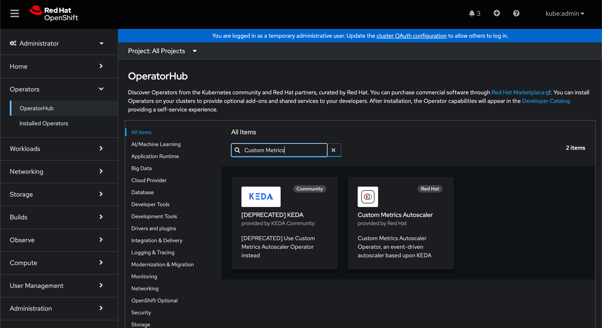
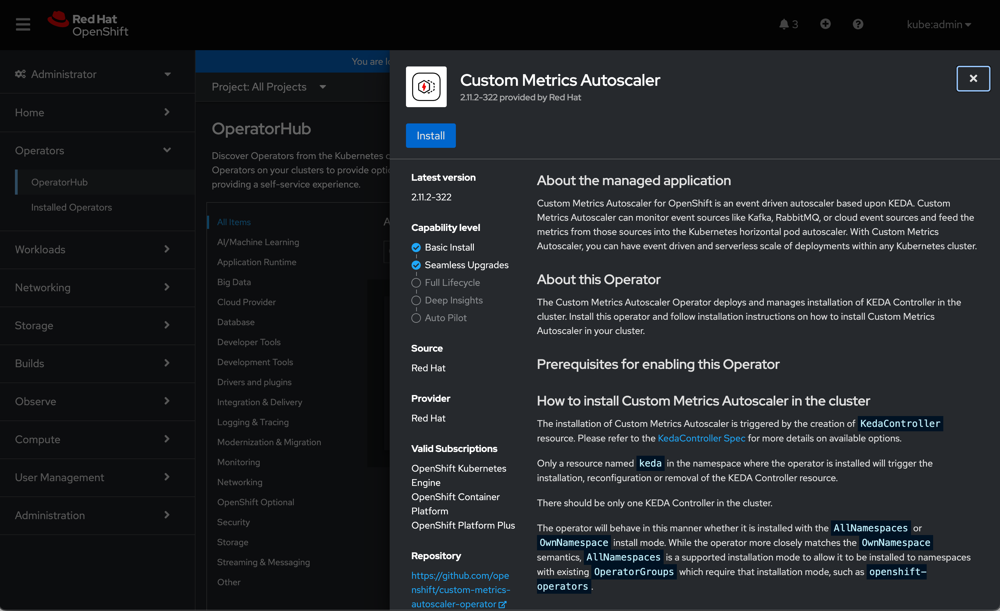
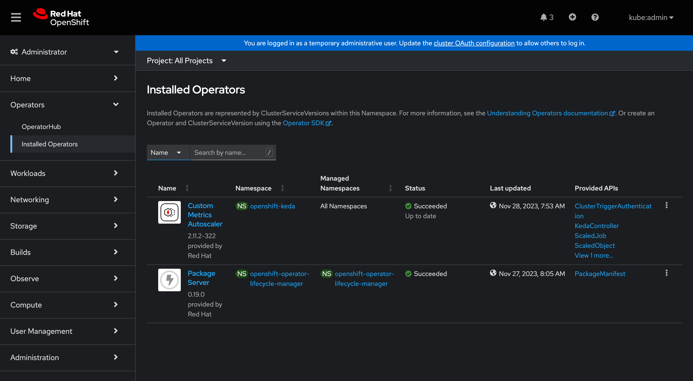
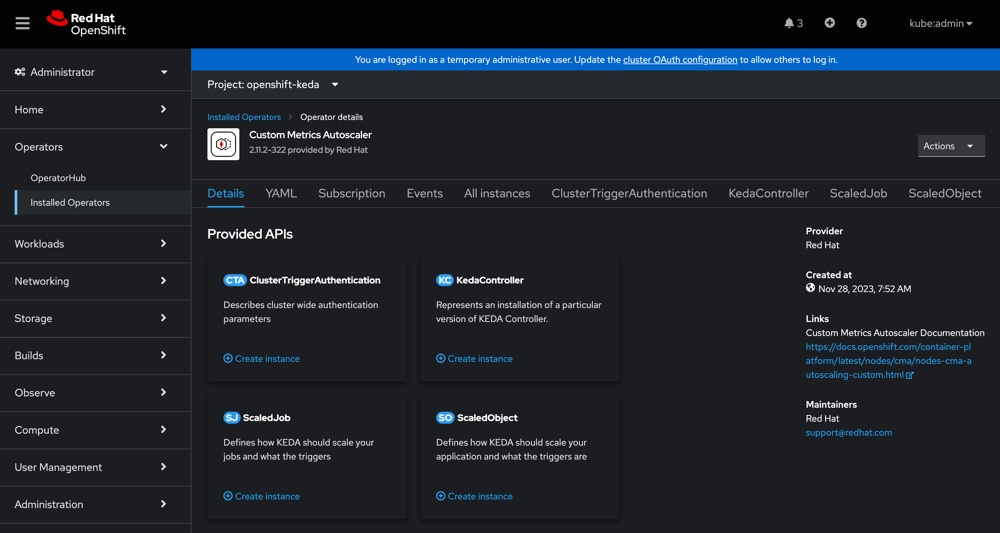
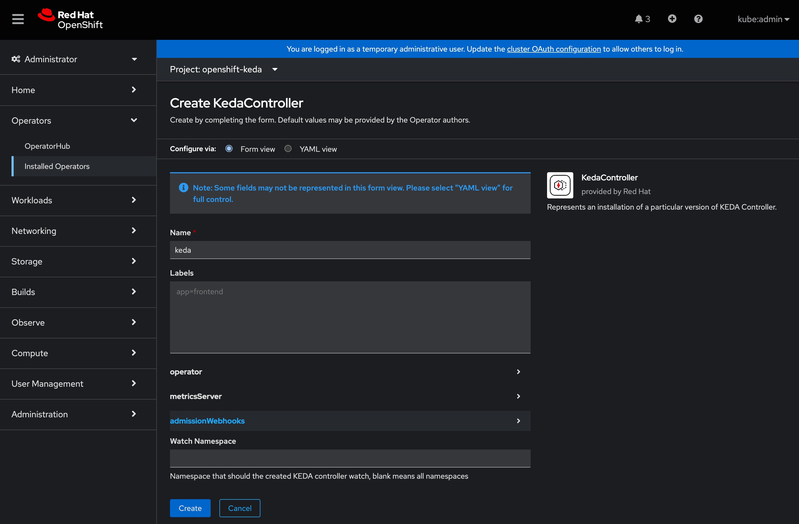

= Custom Metrics Autoscaling

In the previous section, we built a `HorizontalPodAutoscaler` resource that allows our workload to scale by adjusting the number of replicas in the `Deployment` resource. The HPA we created defines a set of threshold values for resource consumption metrics that the cluster automatically gathers from all workloads (i.e., memory and CPU consumption). The cluster can do this because the container runtime provides those metrics in a consistent fashion. Periodically, each HPA defined on the cluster is evaluated against the current metrics and the workloads they target are scaled if need be.

There are many cases, however, where scaling might better be driven by *other* metrics rather than simple resource consumption. As an example, consider the possibility of an event-driven architecture where the number of items in a queue drives the number of deployed `Pod` resources in the workload that processes that queue.

Another example would be workloads that would be able to scale to `0` when there was no demand for them. Because the HPA uses consumption metrics, scaling to zero isn't possible.

The OpenShift https://docs.openshift.com/container-platform/4.14/nodes/cma/nodes-cma-autoscaling-custom.html[Custom Metrics Autoscaler] provides the abstractions needed to drive scaling with arbitrary metrics, and this lab will demonstrate how to enable the CMA on your cluster and then configure it against a workload.

== CMA Architecture

The Custom Metrics Autoscaler works as a wrapper around the core HPA functionality rather than a parallel set of tools. In practice, this means that instead of defining a `HorizontalPodAutoscaler` resource, you'll define a `ScaledObject` that the CMA will use to manage an underyling HPA on your behalf. The `ScaledObject` also defines *where* the desired scaling information will come from (typyically a Prometheus datasource) in terms of an endpoint and a query. 

Most examples (including this one) will demonstrate the configuration and use of an in-cluster datasource (in this case, metrics scraped from the workload itself) 

== Lab Outline

- Install the CMA Operator
- Create a CMA instance
- Create a `ScaledObject` resource
- Test the configuration

== User Workload Monitoring

While there is no requirement that the CMA use metrics that originate in-cluster, that is the most common use-case and is in fact how we'll do it in this lab. We already enabled User Workload Monitoring at the end of the 'Forward Metrics and Logs to Azure Files' section, but we'll verify by making sure it's been configured.

. Check the cluster-monitoring-config ConfigMap object:
+
[source,sh,role=execute]
----
oc -n openshift-monitoring get configmap cluster-monitoring-config -o yaml
----
+
.Sample Output
[source,text,options=nowrap]
----
apiVersion: v1
data:
  config.yaml: |
    enableUserWorkload: true
kind: ConfigMap
metadata:
  creationTimestamp: "2023-11-30T19:37:24Z"
  name: cluster-monitoring-config
  namespace: openshift-monitoring
  resourceVersion: "93720"
  uid: 64cc2837-900d-44e9-a039-108c05a99bd7

----
+
If the `enableUserWorkload: true` line isn't present in your configuration, you can enable is quickly.
+
. Enable User Workload Monitoring:
+
[source,sh,role=execute]
----
oc patch configmap cluster-monitoring-config -n openshift-monitoring \
  --patch='{"data":{"config.yaml": "enableUserWorkload: true\n"}}'
----

. Check that the User workload monitoring is starting up (wait until the output below matches what you see):
+
[source,sh,role=execute]
----
oc -n openshift-user-workload-monitoring get pods
----
+
.Sample Output
[source,text,options=nowrap]
----
NAME                                   READY   STATUS    RESTARTS   AGE
prometheus-operator-78774d88c8-vq2pz   2/2     Running   0          23m
prometheus-user-workload-0             6/6     Running   0          23m
prometheus-user-workload-1             6/6     Running   0          23m
thanos-ruler-user-workload-0           3/3     Running   0          23m
thanos-ruler-user-workload-1           3/3     Running   0          23m
----

=== Install the CMA

TIP: For the purposes of the lab, we're going to install the Custom Metrics Autoscaler Operator via the cluter's web console and the OperatorHub. On a production cluster it's generally recommended to use the GitOps pattern for cluster-level configuration like this. 

. In the OpenShift Container Platform web console, click *Operators → OperatorHub.*
. Type 'Custom Metrics' into the filter box and select the Red Hat version of the Operator.
+

. Click *Install*.
. On the *Install Operator* page for the CMA, accept the default settings.
. Click *Install*.
. Wait until the Operator has installed.
+

. After all you have installed the CMA Operator, click *Operators → Installed Operators* to verify that it was installed.
+

=== Create a KEDA Controller

The installation of the Operator allows us to deploy an actual Controller that performs the adapter functions discussed at the beginning of the lab. Again, we'll use the web console to make creating this easy:

. We'll create a Resource of type `KedaController` by clicking on the *Custom Metrics Autoscaler* in the *Installed Operators* view.

. Make sure to select the Project of `openshift-keda` in the *Project* drop-down at the top of the page.

+

. Click 'Create instance' in the `KedaController` panel.

+

. Verify that the instance name defaults to `keda` and then click the *Create* button at the bottom of the page.

. After a few seconds, you can verify that it installed correctly by looking at the running Pods in the `openshift-keda` namespace:
+
[source,sh,role=execute]
----
oc -n openshift-keda get pods
----
+
.Sample Output
[source,text,options=nowrap]
----
NAME                                                  READY   STATUS    RESTARTS   AGE
custom-metrics-autoscaler-operator-6cbc75447c-gtldf   1/1     Running   0          14m
keda-admission-75fb5fcbcf-znj2d                       1/1     Running   0          118s
keda-metrics-apiserver-65b86548c4-2mqzq               1/1     Running   0          118s
keda-operator-7944475998-cqp55                        1/1     Running   0          119s
----

=== Demo Workload

We'll continue to use the Microsweeper app we've already deployed and scaled for this exercise. We *do* need to delete the HPA resource we created for the workload in the previous section:

. Delete the existing `HorizontalPodAutoscaler`:
+
[source,sh,role=execute]
----
oc delete hpa microsweeper-appservice-cpu
----
This command should respond with confirmation the resource has been deleted.

=== CMA Authentication

The next step is to provide the CMA an identity to allow it to query the API for this custom metrics data our app is producing. The CMA allows for a unique identity per scaled resource, so there is a lot of flexibility and granularity in terms of controlling access to this data.

. Create a `ServiceAccount`
+
[source,sh,role=execute]
----
oc create serviceaccount thanos
----
+
[source,sh,role=execute]
----
oc describe sa thanos
----
+
.Sample Output
[source,text,options=nowrap]
----
Name:                thanos
Namespace:           microsweeper-ex
Labels:              <none>
Annotations:         <none>
Image pull secrets:  thanos-dockercfg-z7j7n
Mountable secrets:   thanos-dockercfg-z7j7n
Tokens:              thanos-token-jrlst
Events:              <none>
----
+
You'll need the value in the `Tokens` field for the next step.
. Create an `AuthenticationTrigger` for the CMA. You'll need to replace the `name` key in the two parameters with the value from the `Tokens` field in the previous step.
+
[source,sh,role=execute]
----
cat <<EOF | oc apply -f -
apiVersion: keda.sh/v1alpha1
kind: TriggerAuthentication
metadata:
  name: keda-trigger-auth-prometheus
spec:
  secretTargetRef:
  - parameter: bearerToken
    name: thanos-token-jrlst
    key: token
  - parameter: ca
    name: thanos-token-jrlst
    key: ca.crt
EOF
----

=== Create a `Role` for the `ServiceAccount`

We have the `ServiceAccount`, now we need a `Role` that gives it the correct permissions on the OCP API to retrieve data.

. Create the `Role`:
+
[source,sh,role=execute]
----
cat <<EOF | oc apply -f -
apiVersion: rbac.authorization.k8s.io/v1
kind: Role
metadata:
  name: thanos-metrics-reader
rules:
- apiGroups:
  - ""
  resources:
  - pods
  verbs:
  - get
- apiGroups:
  - metrics.k8s.io
  resources:
  - pods
  - nodes
  verbs:
  - get
  - list
  - watch
EOF
----
+
. Bind it to the `ServiceAccount`
+
[source,sh,role=execute]
----
oc adm policy add-role-to-user thanos-metrics-reader -z thanos --role-namespace=microsweeper-ex
----

=== Create the `ScaledObject`

Finally, it's time to tell the CMA how to scale the workload based on a custom metric:

. Create the `ScaledObject` resource:
+
[source,sh,role=execute]
----
cat <<EOF | oc apply -f -
apiVersion: keda.sh/v1alpha1
kind: ScaledObject
metadata:
  name: prometheus-scaledobject
spec:
  scaleTargetRef:
    name: microsweeper-appservice
  minReplicaCount: 2
  maxReplicaCount: 10
  triggers:
  - type: prometheus
    metadata:
      serverAddress: https://thanos-querier.openshift-monitoring.svc.cluster.local:9092
      namespace: microsweeper-ex
      authModes: "bearer"
      metricName: http_server_requests_seconds_count
      threshold: '5'
      query: sum(rate(http_server_requests_seconds_count{method="GET",status="200",uri="/api/scoreboard"}[2m]))
    authenticationRef:
      name: keda-trigger-auth-prometheus
EOF
----
+
Note the reference to the `Deployment` we created earlier, both in the `scaleTargetRef` (which identifies the workload to be scaled) as well as in the actual `query` field.
+
Also note the reference to the `TriggerAuthentication` resource in the `authenticationRef` field.
+
Finally, note that just like the HPA, CMA allows for hard `min` and `max` values for the scaled workload.
+
The `threshold` field sets the scaling factor on a *per-replica* basis, so if there is one `Pod` but `11` requests per 2 minutes, it will scale to `3` replicas.
+
. Validate the `ScaledObject`
+
[source,sh,role=execute]
----
oc get so prometheus-scaledobject
----
+
.Sample Output
[source,text,options=nowrap]
----
NAME                      SCALETARGETKIND      SCALETARGETNAME   MIN   MAX   TRIGGERS     AUTHENTICATION                 READY   ACTIVE   FALLBACK   PAUSED    AGE
prometheus-scaledobject   apps/v1.Deployment   cma-demo-app      1     10    prometheus   keda-trigger-auth-prometheus   True    False    False      Unknown   2m40s
----
+ 
We want to make sure the `READY` column is `True`

=== Test the `ScaledObject` resource

Finally, we'll use the `Batch` API to run a bunch of Pods to generate some load and demonstrate the CMA doing its job:

. Create the `Job`:
+
[source,sh,role=execute]
----
cat <<EOF | oc create -f -
apiVersion: batch/v1
kind: Job
metadata:
  generateName: generate-requests-
spec:
  template:
    spec:
      containers:
      - image: quay.io/zroubalik/hey
        name: test
        command: ["/bin/sh"]
        args: ["-c", "for i in $(seq 1 30);do echo $i;/hey -c 5 -n 100 http://microsweeper-appservice.microsweeper-ex.svc/api/scoreboard;sleep 1;done"]
        securityContext:
          allowPrivilegeEscalation: false
          runAsNonRoot: true
          capabilities:
            drop:
              - ALL
          seccompProfile:
            type: RuntimeDefault
      restartPolicy: Never
  activeDeadlineSeconds: 120
  backoffLimit: 2
EOF
----
+
. Watch the workload to see it scale:
+
[source,sh,role=execute]
----
watch oc get deployment microsweeper-appservice
----
+
It will take a minute or two, but the app should eventually scale to 6 replicas, and then scale back down to 
.Sample Output
[source,text,options=nowrap]
----
NAME                      READY   UP-TO-DATE   AVAILABLE   AGE
microsweeper-appservice   6/6     6            6           3h12m
----

