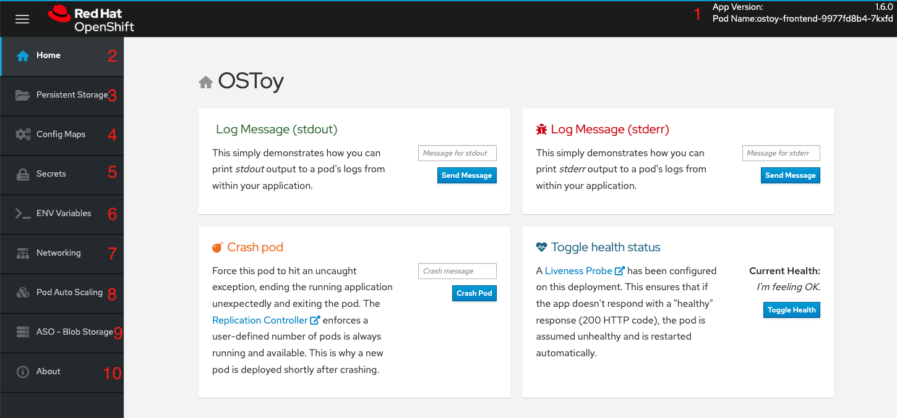
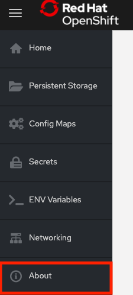

= Application Overview

== Resources

* The source code for this app is available here: https://github.com/openshift-cs/ostoy
* OSToy front-end container image: https://quay.io/repository/ostoylab/ostoy-frontend?tab=tags
* OSToy microservice container image: https://quay.io/repository/ostoylab/ostoy-microservice?tab=tags

== About OSToy

OSToy is a simple Node.js application that we will deploy to Azure Red Hat OpenShift.
It is used to help us explore the functionality of Kubernetes.
This application has a user interface which you can:

* write messages to the log (stdout / stderr)
* intentionally crash the application to view self-healing
* toggle a liveness probe and monitor OpenShift behavior
* read config maps, secrets, and env variables
* if connected to shared storage, read and write files
* check network connectivity, intra-cluster DNS, and intra-communication with an included microservice
* increase the load to view automatic scaling of the pods to handle the load (via the Horizontal Pod Autoscaler)
* connect to an Azure Blob Storage container to read and write objects (if Blob Storage already present)

== OSToy Application Diagram

image::media/managedlab/4-ostoy-arch.png[OSToy Diagram]

== Familiarization with the Application UI

. Shows the pod name that served your browser the page.
. *Home:* The main page of the application where you can perform some of the functions listed which we will explore.
. *Persistent Storage:*  Allows us to write data to the persistent volume bound to this application.
. *Config Maps:*  Shows the contents of configmaps available to the application and the key:value pairs.
. *Secrets:* Shows the contents of secrets available to the application and the key:value pairs.
. *ENV Variables:* Shows the environment variables available to the application.
. *Auto Scaling:* Explore the Horizontal Pod Autoscaler to see how increased loads are handled.
. *Networking:* Tools to illustrate networking within the application.
. *ASO - Blob Storage:* Integrate with Azure Blob Storage to read and write objects to a container.
. *About:* Shows some more information about the application.

== Learn more about the application

To learn more, click on the "About" menu item on the left once we deploy the app.

