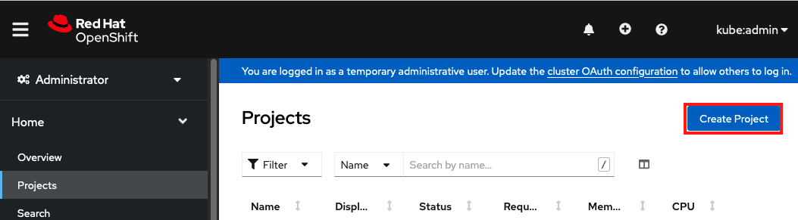
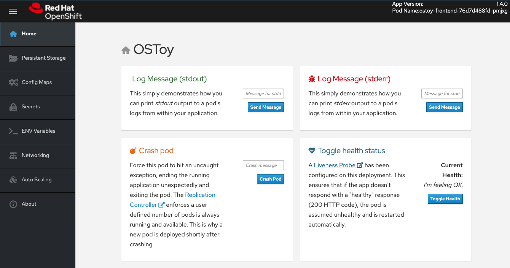

== Application Deployment

=== Create new project

WARNING: You must be logged in as an administrator.

. Check to see that you're logged in as kubeadmin.
+
[source,sh,role=execute]
----
oc whoami
----
+
.Sample Output
[source,text,options=nowrap]
----
openenv-admin-%guid%@azure.opentlc.com

OR

kube:admin
----

Create a new project called "OSToy" in your cluster.

. Use the following command:
+
[source,sh,role=execute]
----
oc new-project ostoy
----
+
.Sample Output
[source,text,options=nowrap]
----
Now using project "ostoy" on server "https://api.asbogcsy.eastus.aroapp.io:6443".

You can add applications to this project with the 'new-app' command. For example, try:

    oc new-app rails-postgresql-example

to build a new example application in Ruby. Or use kubectl to deploy a simple Kubernetes application:

    kubectl create deployment hello-node --image=k8s.gcr.io/e2e-test-images/agnhost:2.33 -- /agnhost serve-hostname
----

Equivalently you can also create this new project using the web console by selecting _Home > Projects_ on the left menu, then clicking on the "Create Project" button on the right.

=== View the YAML deployment manifest

View the Kubernetes deployment manifest.
If you wish you can download them from the following locations to your Azure Cloud Shell, to your local machine, or just use the direct link in the next steps.

Feel free to open them up and take a look at what we will be deploying.
For simplicity of this lab we have placed all the Kubernetes objects we are deploying in one "all-in-one" YAML file.
Though in reality there are benefits (ease of maintenance and less risk) to separating these out into individual files.

https://github.com/microsoft/aroworkshop/blob/master/yaml/ostoy-frontend-deployment.yaml[ostoy-frontend-deployment.yaml]

https://github.com/microsoft/aroworkshop/blob/master/yaml/ostoy-microservice-deployment.yaml[ostoy-microservice-deployment.yaml]

=== Deploy backend microservice

The microservice serves internal web requests and returns a JSON object containing the current hostname and a randomly generated color string.

. In your terminal deploy the microservice using the following command:
+
[source,sh,role=execute]
----
oc apply -f https://raw.githubusercontent.com/microsoft/aroworkshop/master/yaml/ostoy-microservice-deployment.yaml
----
+
.Sample Output
[source,text,options=nowrap]
----
deployment.apps/ostoy-microservice created
service/ostoy-microservice-svc created
----

=== Deploy the front-end service

This deployment contains the node.js frontend for our application along with a few other Kubernetes objects.

.If you open the _ostoy-frontend-deployment.yaml_ you will see we are defining:
* Persistent Volume Claim
* Deployment Object
* Service
* Route
* Configmaps
* Secrets

. Deploy the frontend along with creating all objects mentioned above by entering:
+
[source,sh,role=execute]
----
oc apply -f https://raw.githubusercontent.com/microsoft/aroworkshop/master/yaml/ostoy-frontend-deployment.yaml
----
+
.Sample Output
[source,text,options=nowrap]
----
persistentvolumeclaim/ostoy-pvc created
deployment.apps/ostoy-frontend created
service/ostoy-frontend-svc created
route.route.openshift.io/ostoy-route created
secret/ostoy-secret-env created
configmap/ostoy-configmap-files created
secret/ostoy-secret created
----

=== Get route

. Get the route so that we can access the application via:
+
[source,sh,role=execute]
----
oc get route
----
+
.Sample Output
[source,text,options=nowrap]
----
NAME          HOST/PORT                                          PATH   SERVICES             PORT    TERMINATION   WILDCARD
ostoy-route   ostoy-route-ostoy.apps.asbogcsy.eastus.aroapp.io          ostoy-frontend-svc   <all>                 None
----

. Copy `ostoy-route-ostoy.apps.asbogcsy.eastus.aroapp.io` above and paste it into your browser and press enter. Ensure that it is *http://* and not *https://*.
You should see the homepage of our application.
+

