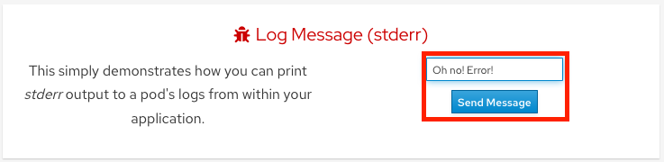

= Logging and Metrics

Assuming you can access the application via the Route provided and are still logged into the CLI we'll start to use this application.

As stated earlier, this application will allow you to "push the buttons" of OpenShift and see how it works.
We will do this to test the logs.

. Click on the _Home_ menu item and then click in the message box for "Log Message (stdout)" and write any message you want to output to the _stdout_ stream.
You can try "*All is well!*".
Then click "Send Message".
+
image::media/managedlab/8-ostoy-stdout.png[Logging stdout]

. Click in the message box for "Log Message (stderr)" and write any message you want to output to the _stderr_ stream.
You can try "*Oh no!
Error!*".
Then click "Send Message".
+ 

=== View logs directly from the pod

. Go to the CLI and enter the following command to retrieve the name of your frontend pod which we will use to view the pod logs:
+
[source,sh,role=execute]
----
oc get pods -o name
----
+
.Sample Output
[source,text,options=nowrap]
----
pod/ostoy-frontend-5f6b9c9b67-w5cj4
pod/ostoy-microservice-5b6dd698df-f2zvq
----
+
So the pod name in this case is *ostoy-frontend-5f6b9c9b67-w5cj4*.

. We can use that to view the logs of that pod. Run the following and you should see your messages:
+
[source,sh,role=execute]
----
oc logs $(oc get pods -o name | grep frontend)
----
+
.Sample Output
[source,text,options=nowrap]
----
Version: 1.6.0
ostoy-frontend-5f6b9c9b67-w5cj4: server starting on port 8080
ACK feature disabled. ostoy-bucket not found.
Connection string secret file does not exist or is not readable.
ASO feature disabled. Connection string not found.
Redirecting to /home

stdout: All is well!
stderr: Oh no! Error!
----

. Try to see them from within the OpenShift Web Console as well.
+
Make sure you are in the "ostoy" project.
+
In the left menu click _Workloads > Pods > <frontend-pod-name>_.
+
Then click the "Logs" sub-tab.
+
image::media/managedlab/9-ostoy-wclogs.png[web-pods]

=== View metrics and logs by integrating with Azure Arc

You can use Azure services for metrics and logging by enabling your ARO cluster with Azure Arc. Connecting to ARC was already completed in the earlier script we ran.

. Back in the Azure web console (https://portal.azure.com) type *Azure Arc* in the search bar from the Home screen and select *Kubernetes - Azure Arc*.
+
image::media/managedlab/36-searcharc.png[arckubernetes]

. Click on the Arc connected cluster you just created, then click on *Insights* under the *Monitoring* heading on the left.
+
image::media/managedlab/37-arcselect.png[arcclusterselect]
+
You will see a page with all sorts of metrics for the cluster.
+
image::media/managedlab/38-clustermetrics.png[clustermetrics]
+
NOTE: Please feel free to come back to this section after the "Pod Autoscaling" section and see how you can use Container Insights to view metrics.
You may need to add a filter by "namespace" to see the pods from our application.

. To see the log messages we outputted to _stdout_ and _stderr_, click on "Logs" in the left menu, then the "Container Logs" query.

. Finally, click "Load to editor" for the pre-created query called "Find a value in Container Logs Table".
+
image::media/managedlab/39-containerlogs.png[containerlogs]
+
This will populate a query that requires a parameter to search for.

. Let's look for our error entry. Type "stderr" in the location for `FindString`, then click run.
+
You should see one line returned that contains the message you inputted earlier. You can also click the twist for more information.
+
image::media/managedlab/40-getlogmessage.png[getmessage]
+
Feel free to spend a few minutes exploring logs with the pre-created queries or try your own to see how robust the service is.

