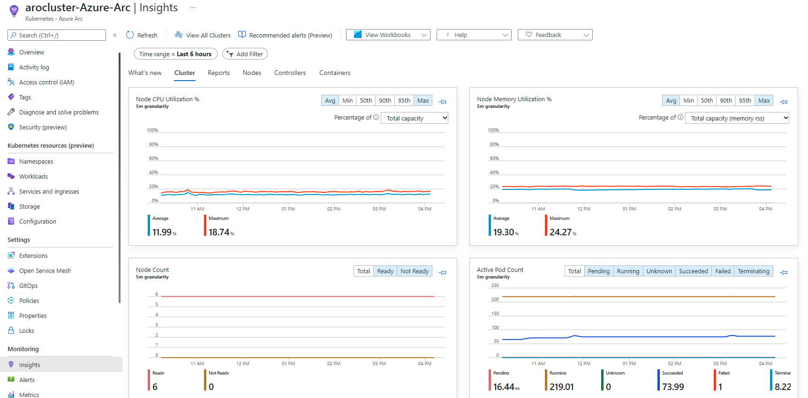

= Logging and Metrics

Assuming you can access the application via the Route provided and are still logged into the CLI we'll start to use this application.

As stated earlier, this application will allow you to "push the buttons" of OpenShift and see how it works.
We will do this to test the logs.

. Click on the _Home_ menu item and then click in the message box for "Log Message (stdout)" and write any message you want to output to the _stdout_ stream.
You can try "*All is well!*".
Then click "Send Message".
+
image::media/managedlab/8-ostoy-stdout.png[Logging stdout]

. Click in the message box for "Log Message (stderr)" and write any message you want to output to the _stderr_ stream.
You can try "*Oh no!
Error!*".
Then click "Send Message".
+ 
image::media/managedlab/9-ostoy-stderr.png[Logging stderr]

=== View logs directly from the pod

. Go to the CLI and enter the following command to retrieve the name of your frontend pod which we will use to view the pod logs:
+
[source,sh,role=execute]
----
oc get pods -o name
----
+
.Sample Output
[source,text,options=nowrap]
----
pod/ostoy-frontend-5f6b9c9b67-w5cj4
pod/ostoy-microservice-5b6dd698df-f2zvq
----
+
So the pod name in this case is *ostoy-frontend-5f6b9c9b67-w5cj4*.

. Then run `oc logs deploy/ostoy-frontend` and you should see your messages:
+
[source,sh,role=execute]
----
oc logs deploy/ostoy-frontend
----
+
.Sample Output
[source,text,options=nowrap]
----
npm info it worked if it ends with ok
npm info using npm@6.14.6
npm info using node@v10.22.1
npm info lifecycle ostoy@1.4.0~prestart: ostoy@1.4.0
npm info lifecycle ostoy@1.4.0~start: ostoy@1.4.0

> ostoy@1.4.0 start /
> node app.js

Version: 1.4.0
ostoy-frontend-5f6b9c9b67-w5cj4: server starting on port 8080
stdout: All is well!
stderr: Oh no! Error!
----

. Try to see them from within the OpenShift Web Console as well.
+
Make sure you are in the "ostoy" project.
+
In the left menu click _Workloads > Pods > <frontend-pod-name>_.
+
Then click the "Logs" sub-tab.
+

////
=== View metrics and logs by integrating with Azure Arc

You can use Azure services for metrics and logging by enabling your ARO cluster with Azure Arc.

The instructions for setting this up can be found at the following locations.

Perform them in the following order. *These are prerequisites for this part of the lab*.

=== Set up Azure Arc connection to OpenShift

[TIP]
====
If you ever need to set this up from scratch the instructions can be fond here:

* https://docs.microsoft.com/en-us/azure/azure-arc/kubernetes/quickstart-connect-cluster?tabs=azure-cli[Connect an existing cluster to Azure Arc]
* https://docs.microsoft.com/en-us/azure/azure-monitor/containers/container-insights-enable-arc-enabled-clusters?toc=%2Fazure%2Fazure-arc%2Fkubernetes%2Ftoc.json&bc=%2Fazure%2Fazure-arc%2Fkubernetes%2Fbreadcrumb%2Ftoc.json[Azure Monitor Container Insights for Azure Arc-enabled Kubernetes clusters]
====

. Make sure that the `az` tool has the extension installed for `connectedk8s`.
+
[source,sh,role=execute]
----
az extension add --name connectedk8s
az extension add --name k8s-extension
----

. Create workspace:
+
[source,sh,role=execute]
----
az monitor log-analytics workspace create \
  --resource-group openenv-${GUID} \
  --workspace-name workspace-${GUID}
----
+
.Sample Output
[source,text,options=nowrap]
----
{
  "createdDate": "2023-04-27T17:58:33.1467877Z",
  "customerId": "646d8555-46e8-48d4-9641-d06ff4a7d918",
  "features": {
    "enableLogAccessUsingOnlyResourcePermissions": true
  },
  "id": "/subscriptions/ede7f891-835c-4128-af5b-0e53848e54e7/resourceGroups/openenv-2tjmq/providers/Microsoft.OperationalInsights/workspaces/workspace-2tjmq",
  "location": "eastus",
  "modifiedDate": "2023-04-27T17:58:33.1467877Z",
  "name": "workspace-2tjmq",
  "provisioningState": "Creating",
  "publicNetworkAccessForIngestion": "Enabled",
  "publicNetworkAccessForQuery": "Enabled",
  "resourceGroup": "openenv-2tjmq",
  "retentionInDays": 30,
  "sku": {
    "lastSkuUpdate": "2023-04-27T17:58:33.1467877Z",
    "name": "PerGB2018"
  },
  "type": "Microsoft.OperationalInsights/workspaces",
  "workspaceCapping": {
    "dailyQuotaGb": -1.0,
    "dataIngestionStatus": "RespectQuota",
    "quotaNextResetTime": "2023-04-28T05:00:00Z"
  }
}
----

. Create extension instance:
+
[source,sh,role=execute]
----
az k8s-extension create --name azuremonitor-containers  --extension-type Microsoft.AzureMonitor.Containers --scope cluster --cluster-name aro-cluster-${GUID} --resource-group openenv-${GUID} --cluster-type connectedClusters
----
+
.Sample Output
[source,text,options=nowrap]
----

----

. Double check that the providers are already registered in your account:
+
[source,sh,role=execute]
----
az provider show -n Microsoft.Kubernetes -o table
az provider show -n Microsoft.KubernetesConfiguration -o table
az provider show -n Microsoft.ExtendedLocation -o table
----
+
.Sample Output
[source,text,options=nowrap]
----
Namespace             RegistrationPolicy    RegistrationState
--------------------  --------------------  -------------------
Microsoft.Kubernetes  RegistrationRequired  Registered

Namespace                          RegistrationPolicy    RegistrationState
---------------------------------  --------------------  -------------------
Microsoft.KubernetesConfiguration  RegistrationRequired  Registered

Namespace                   RegistrationPolicy    RegistrationState
--------------------------  --------------------  -------------------
Microsoft.ExtendedLocation  RegistrationRequired  Registered
----

. Connect your cluster:
+
[source,sh,role=execute]
----
az connectedk8s connect --name aro-cluster-${GUID} --resource-group openenv-${GUID}
----
+
.Sample Output
[source,text,options=nowrap]
----
This operation might take a while...

Downloading kubectl client for first time. This can take few minutes...
To check existing issues, please visit: https://github.com/Azure/azure-cli/issues
To open a new issue, please run `az feedback`

Downloading helm client for first time. This can take few minutes...
{
  "agentPublicKeyCertificate": "MIICCgKCAgEAsyF3q8jlSzJ60LMV5CLYiX5eWDkJG0BzNM0/HIYpTpC76oIDiz8vwADvo1bv6eH7yTTNLiIdfhxFtk8+w3Oh22Z6AMqEaOU+vgr2ykSi1+I0ySGMb6NgV7nSaQ6i32eTy/CuEc68jLOrAQA6RJ0Ya5U8FisfTevwO3WHeo8io6AUieOMYXkQBw1C0mF09TtceUqJPlxCRyYGPYEDQThtfD8Aty42FwDF0qlR02d8ma8Okofq6kpS2YRGdsewuPhY0rcn7yQsZBU29+QczufpSpvd/F/v7AuwapwLjOG8/HoLB/K+i3dbgdu3dj0oEqW7J7Jf44l7N3NdkFjWzAFwJ1jOcBlR42GwURgQ9kmAcuy7M93l/jsUGxNycI2JDhqbhTkh+PWnsG9ix/qIcM4TwVvVs5v01m1bO6exu/LZMXTudjZyUMtI7rH+Gqr6J6p5oPt2XSomZ09guupN8M72a894QJOi4haO7NKKiaRVOpOaI2dUPeTsBS+QXSGOtJzN/c92o+h5PxPbzyZ5fYsTaxt88x53MUgmg3CzLDqlBWTcDZeECsZQcakodETLj3Kr2Ly8GgZhSjNXqHyYbIc9D7pU0Jmj+csM+6SDiEBs8gQQBeg1wQyBVbFLdgHwcSltfrnRa61R9JGaFQ50r0SyIkv4bDny22enZvzndXtDkAcCAwEAAQ==",
  "agentVersion": null,

[...Output omitted...]

  "totalNodeCount": null,
  "type": "microsoft.kubernetes/connectedclusters"
}
----

. Verify the cluster connection:
+
[source,sh,role=execute]
----
az connectedk8s list --resource-group openenv-${GUID} --output table
----
+
.Sample Output
[source,text,options=nowrap]
----
Name               Location    ResourceGroup
-----------------  ----------  ---------------
aro-cluster-2tjmq  eastus      openenv-2tjmq
----

. View the Azure Arc agents that got deployed to your cluster:
+
[source,sh,role=execute]
----
oc get deployments,pods -n azure-arc
----
+
.Sample Output
[source,text,options=nowrap]
----
NAME                                         READY   UP-TO-DATE   AVAILABLE   AGE
deployment.apps/cluster-metadata-operator    1/1     1            1           4m2s
deployment.apps/clusterconnect-agent         1/1     1            1           4m2s
deployment.apps/clusteridentityoperator      1/1     1            1           4m2s
deployment.apps/config-agent                 1/1     1            1           4m2s
deployment.apps/controller-manager           1/1     1            1           4m2s
deployment.apps/extension-events-collector   1/1     1            1           4m2s
deployment.apps/extension-manager            1/1     1            1           4m2s
deployment.apps/flux-logs-agent              1/1     1            1           4m2s
deployment.apps/kube-aad-proxy               1/1     1            1           4m2s
deployment.apps/metrics-agent                1/1     1            1           4m2s
deployment.apps/resource-sync-agent          1/1     1            1           4m2s

NAME                                            READY   STATUS    RESTARTS   AGE
pod/cluster-metadata-operator-cd576b5f4-c2x4t   2/2     Running   0          4m2s
pod/clusterconnect-agent-5f4f8499d5-ltp4j       3/3     Running   0          4m2s
pod/clusteridentityoperator-67b9d886c4-59x58    2/2     Running   0          4m2s
pod/config-agent-5c9ff7b45d-zqfhs               2/2     Running   0          4m2s
pod/controller-manager-6d76f96759-mpl4h         2/2     Running   0          4m2s
pod/extension-events-collector-976bdf84-skndg   2/2     Running   0          4m2s
pod/extension-manager-7464dff6cc-nbqxx          3/3     Running   0          4m2s
pod/flux-logs-agent-5677f94cb6-bmtk6            1/1     Running   0          4m2s
pod/kube-aad-proxy-86bb95887b-zjdrm             2/2     Running   0          4m2s
pod/metrics-agent-5f9df86657-phx52              2/2     Running   0          4m2s
pod/resource-sync-agent-59cddd96c-t9z2l         2/2     Running   0          4m2s
----

. Back in the Azure web console (https://portal.azure.com) type *Azure Arc* in the search bar from the Home screen and select *Kubernetes - Azure Arc*.
+

. Click on the Arc connected cluster you just created, then click on *Insights* under the *Monitoring* heading on the left.
+

+
You will see a page with all sorts of metrics for the cluster.
+

~~ Click on *Configure azure monitor*
~~ Create New Workspace, name it `insights`

NOTE: Please feel free to come back to this section after the "Pod Autoscaling" section and see how you can use Container Insights to view metrics.
You may need to add a filter by "namespace" to see the pods from our application.

To see the log messages we outputted to _stdout_ and _stderr_, click on "Logs" in the left menu, then the "Container Logs" query.
Finally, click "Load to editor" for the pre-created query called "Find a value in Container Logs Table".

image::media/managedlab/39-containerlogs.png[containerlogs]

This will populate a query that requires a parameter to search for.
Let's look for our error entry.
Type "stderr" in the location for `FindString`, then click run.
You should see one line returned that contains the message you inputted earlier.
You can also click the twist for more information.

image::media/managedlab/40-getlogmessage.png[getmessage]

Feel free to spend a few minutes exploring logs with the pre-created queries or try your own to see how robust the service is.
////
