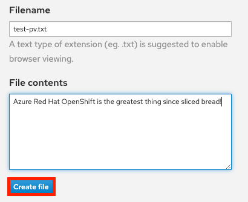
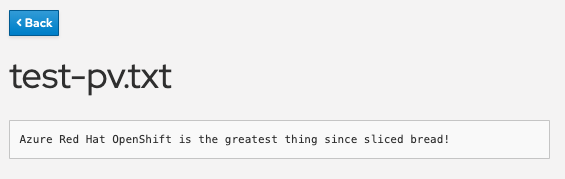

= Persistent Storage

In this section we will execute a simple example of using persistent storage by creating a file that will be stored on a persistent volume in our cluster and then confirm that it will "persist" across pod failures and recreation.

. Inside the OpenShift web console click on _Storage > Persistent Volume Claims_ in the left menu.
+
You will then see a list of all persistent volume claims that our application has made.
+
In this case there is just one called "ostoy-pvc".

. If you click on it you will also see other pertinent information such as whether it is bound or not, size, access mode and creation time.

. Alternatively, you can use the CLI to get the same information.
+
[source,sh,role=execute]
----
oc describe pvc ostoy-pvc
----
+
In this case the mode is RWO (Read-Write-Once) which means that the volume can only be mounted to one node, but the pod(s) can both read and write to that volume.
+
The link:++https://docs.microsoft.com/en-us/azure/openshift/openshift-faq#can-we-choose-any-persistent-storage-solution--like-ocs++[default in ARO] is for Persistent Volumes to be backed by Azure Disk, but it is possible to https://docs.openshift.com/container-platform/latest/storage/persistent_storage/persistent-storage-azure-file.html[use Azure Files] so that you can use the RWX (Read-Write-Many) access mode.
See here for more info on https://docs.openshift.com/container-platform/latest/storage/understanding-persistent-storage.html#pv-access-modes_understanding-persistent-storage[access modes].

. In the OSToy app click on _Persistent Storage_ in the left menu.

. In the "Filename" area enter a filename for the file you will create (e.g., "test-pv.txt").

. Underneath that, in the "File contents" box, enter text to be stored in the file.
(e.g., "Azure Red Hat OpenShift is the greatest thing since sliced bread!").

. Then click "Create file".
+

+
You will then see the file you created appear above under "Existing files".
Click on the file and you will see the filename and the contents you entered.
+

. We now want to kill the pod and ensure that the new pod that spins up will be able to see the file we created.
+
Exactly like we did in the previous section. Click on _Home_ in the left menu.

. Click on the "Crash pod" button.
(You can enter a message if you'd like).

. Click on _Persistent Storage_ in the left menu.
+
You will see the file you created is still there and you can open it to view its contents to confirm.
+
image::media/managedlab/19-ostoy-existingfile.png[Crash Message]

. Now let's confirm that it's actually there by using the CLI and checking if it is available to the container.
If you remember we https://github.com/microsoft/aroworkshop/blob/master/yaml/ostoy-frontend-deployment.yaml#L50[mounted the directory] `/var/demo_files` to our PVC.
So get the name of your frontend pod:
+
[source,sh,role=execute]
----
oc get pods
----
+
.Sample Output
[source,text,options=nowrap]
----
NAME                                  READY   STATUS    RESTARTS   AGE
ostoy-frontend-5f6b9c9b67-w5cj4       1/1     Running   0          152m
ostoy-microservice-5b6dd698df-f2zvq   1/1     Running   0          153m
----

. Then open an interactive shell session inside the container within our pod:
+
[source,sh,role=execute]
----
POD_NAME=$(oc get pods -o name | grep frontend)

oc rsh $POD_NAME
----

. Access the mounted directory.
+
[source,sh,role=execute]
----
cd /var/demo_files
----

. Enter `ls` to see all the files you created.
+
[source,sh,role=execute]
----
ls
----

. Next, let's open the file we created and see the contents. (If you named it differently you will need to use that name)
+
[source,sh,role=execute]
----
cat test-pv.txt; echo
----
+
You should see the text you entered in the UI.

. Then exit the SSH session.
+
[source,sh,role=execute]
----
exit
----
