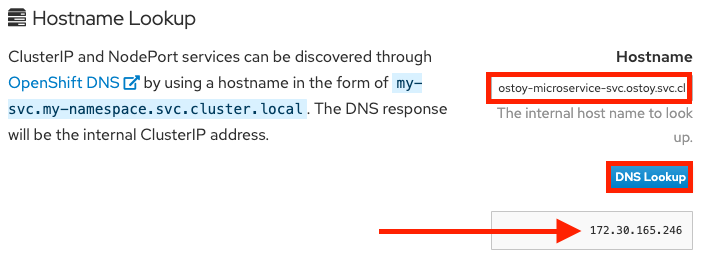

= Networking

In this section we'll see how OSToy uses intra-cluster networking to separate functions by using microservices.

Let's review how this application is set up.

image::media/managedlab/4-ostoy-arch.png[OSToy Diagram]

As can be seen in the image above we have defined at least 2 separate pods, each with its own service.

One is the frontend web application (with a service and a publicly accessible route) and the other is the backend microservice with a service object created so that the frontend pod can communicate with the microservice (across the pods if more than one).

Therefore this microservice is not accessible from outside this cluster (or from other namespaces/projects, if configured, due to OpenShifts' network policy, https://docs.openshift.com/container-platform/latest/networking/network_policy/about-network-policy.html#nw-networkpolicy-about_about-network-policy[ovs-networkpolicy]).

The sole purpose of this microservice is to serve internal web requests and return a JSON object containing the current hostname and a randomly generated color string.
This color string is used to display a box with that color displayed in the tile titled "Intra-cluster Communication".

== Networking

. Click on _Networking_ in the left menu.
+
Review the networking configuration.
+
The right tile titled "Hostname Lookup" illustrates how the service name created for a pod can be used to translate into an internal ClusterIP address.
+

. Enter the name of the microservice following the format of `<my-svc>.<my-namespace>.svc.cluster.local` which we created in our `ostoy-microservice.yaml` as seen here:
+
[source,yaml]
----
apiVersion: v1
kind: Service
metadata:
  name: ostoy-microservice-svc
  labels:
    app: ostoy-microservice
spec:
  type: ClusterIP
  ports:
    - port: 8080
      targetPort: 8080
      protocol: TCP
  selector:
    app: ostoy-microservice
----
+
In this case we will enter: `ostoy-microservice-svc.ostoy.svc.cluster.local`
+
We will see an IP address returned.
In our example it is `172.30.165.246`.
+
This is the intra-cluster IP address;
only accessible from within the cluster.
+

+
The ostoy-frontend service is exposed via an Openshift route object that has a DNS name for the service.
+
[source,sh,role=execute]
----
oc get route ostoy-route -o "jsonpath={.spec.host}"
----
+
The IP address corresponding to that DNS name is configured on the Azure Load Balancer that is automatically created when the ARO cluster is created.
+
[source,sh,role=execute]
----
export LB_EXTERNAL=$(az network lb list --resource-group openenv-${GUID} --query "[].name" -o tsv | grep %GUID | grep -v internal)
export ROUTER_IP_ID=$(az network lb frontend-ip list --resource-group openenv-${GUID} --lb-name $LB_EXTERNAL --query [].[publicIPAddress.id] -o tsv | grep -E -m 1 "default" | grep -E -o "$LB_EXTERNAL.*\$")
az network public-ip show --resource-group openenv-${GUID} -n $ROUTER_IP_ID --query ipAddress -o tsv
----
+
That IP is associated with the router-default kubernetes service that provides the routes functionality (similar to kubernetes ingress, implemented with a pair of HA proxy pods).
+
[source,sh,role=execute]
----
oc get svc router-default -n openshift-ingress -o jsonpath='{.spec.loadBalancerIP}{"\n"}'
----
+
