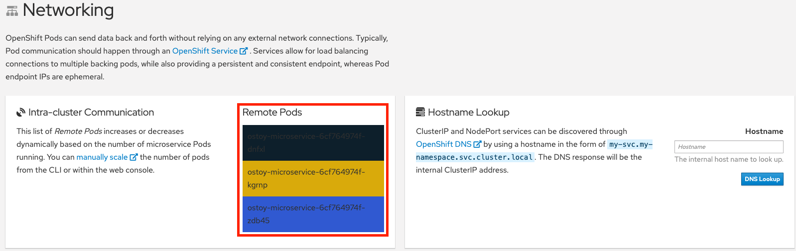
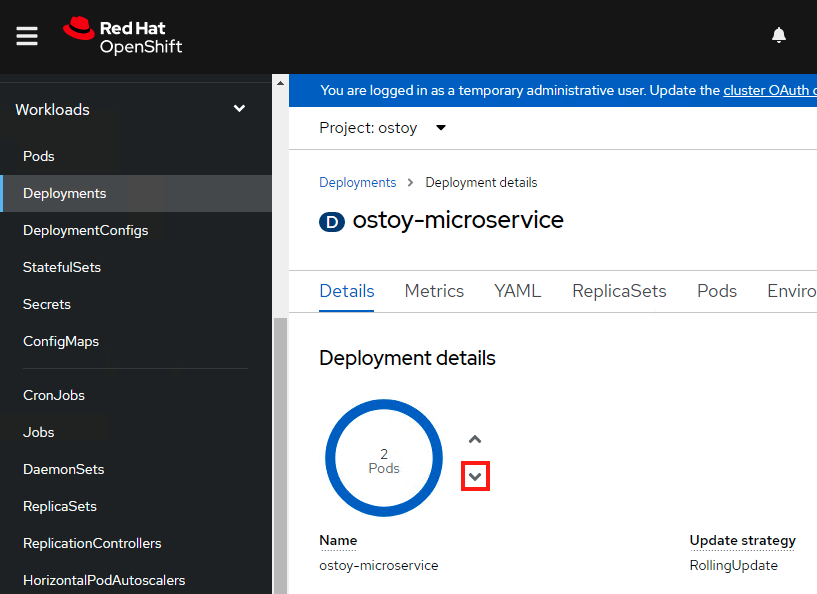

= Scaling

OpenShift allows one to scale up/down the number of pods for each part of an application as needed.

This can be accomplished via changing our _replicaset/deployment_ definition (declarative), by the command line (imperative), or via the web console (imperative).

In our _deployment_ definition (part of our `ostoy-fe-deployment.yaml`) we stated that we only want one pod for our microservice to start with.

This means that the Kubernetes Replication Controller will always strive to keep one pod alive.

We can also define pod autoscaling using the https://docs.openshift.com/container-platform/latest/nodes/pods/nodes-pods-autoscaling.html[Horizontal Pod Autoscaler] (HPA) based on load to expand past what we defined.
We will do this in a later section of this lab.

If we look at the tile on the left we should see one box randomly changing colors.

This box displays the randomly generated color sent to the frontend by our microservice along with the pod name that sent it.

Since we see only one box that means there is only one microservice pod.

We will now scale up our microservice pods and will see the number of boxes change.

To confirm that we only have one pod running for our microservice, run the following command, or use the web console.

[source,sh,role=execute]
----
oc get pods
----

.Sample Output
[source,text,options=nowrap]
----
NAME                                   READY     STATUS    RESTARTS   AGE
ostoy-frontend-679cb85695-5cn7x       1/1       Running   0          1h
ostoy-microservice-86b4c6f559-p594d   1/1       Running   0          1h
----

Let's change our microservice definition yaml to reflect that we want 3 pods instead of the one we see.

[source,sh,role=execute]
----
oc scale deployment ostoy-microservice --replicas=3
----

.Sample Output
[source,text,options=nowrap]
----
deployment.apps/ostoy-microservice scaled
----

Confirm that there are now 3 pods via the CLI (`oc get pods`) or the web console (_Workloads > Deployments > ostoy-microservice_).

See this visually by visiting the OSToy app and seeing how many boxes you now see.
It should be three.

Now we will scale the pods down using the command line.
Execute the following command from the CLI:

[source,sh,role=execute]
----
oc scale deployment ostoy-microservice --replicas=2
----

Confirm that there are indeed 2 pods, via the CLI (`oc get pods`) or the web console.

See this visually by visiting the OSToy app and seeing how many boxes you now see.
It should be two.

Lastly, let's use the web console to scale back down to one pod.

Make sure you are in the project you created for this app (i.e., "ostoy"), in the left menu click _Workloads > Deployments > ostoy-microservice_.

On the left you will see a blue circle with the number 2 in the middle.

Click on the down arrow to the right of that to scale the number of pods down to 1.

See this visually by visiting the OSToy app and seeing how many boxes you now see.

It should be one.

You can also confirm this via the CLI or the web console.
