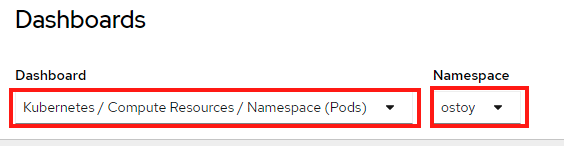
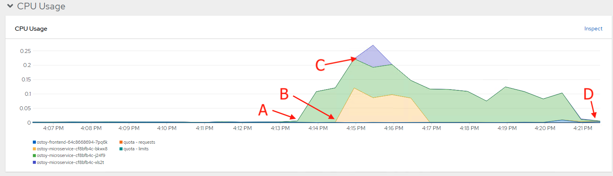

= Pod Autoscaling

In this section we will explore how the https://docs.openshift.com/container-platform/latest/nodes/pods/nodes-pods-autoscaling.html[Horizontal Pod Autoscaler] (HPA) can be used and works within Kubernetes/OpenShift.

As defined in the documentation:

____
[...] you can use a horizontal pod autoscaler (HPA) to specify how OpenShift Container Platform should automatically increase or decrease the scale of a replication controller or deployment configuration, based on metrics collected from the pods that belong to that replication controller or deployment configuration.
____

In more simple words, "if there is a lot of work, make more pods".

We will create a HPA and then use OSToy to generate CPU intensive workloads.
We will then observe how the HPA will scale up the number of pods in order to handle the increased workloads.

== Create the Horizontal Pod Autoscaler

Run the following command to create the HPA.
This will create an HPA that maintains between 1 and 10 replicas of the pods controlled by the _ostoy-microservice_ deployment created.
Roughly speaking, the HPA will increase and decrease the number of replicas (via the deployment) to maintain an average CPU utilization across all pods of 80% (since each pod requests 50 millicores, this means average CPU usage of 40 millicores).

`oc autoscale deployment/ostoy-microservice --cpu-percent=80 --min=1 --max=10`

== View the current number of pods

In the OSToy app in the left menu, click on "Autoscaling" to access this portion of the workshop.

image::media/managedlab/32-hpa-menu.png[HPA Menu]

As was in the networking section you will see the total number of pods available for the microservice by counting the number of colored boxes.
In this case we have only one.
This can be verified through the web console or from the CLI.

image::media/managedlab/33-hpa-mainpage.png[HPA Main]

You can use the following command to see the running microservice pods only:

`oc get pods --field-selector=status.phase=Running | grep microservice`

== Increase the load

Since we now only have one pod, let's increase the workload that the pod needs to perform.
Click the link in the center of the card that says "increase the load".
*Please click only _ONCE_!*

This will generate some CPU intensive calculations.
(If you are curious about what it is doing you can click https://github.com/openshift-cs/ostoy/blob/master/microservice/app.js#L32[here]).

NOTE: The page may become slightly unresponsive.
This is normal;
so be patient while the new pods spin up.

== See the pods scale up

After about a minute the new pods will show up on the page (represented by the colored rectangles).
Confirm that the pods did indeed scale up through the OpenShift Web Console or the CLI (you can use the command above).

NOTE: The page may still lag a bit which is normal.

You can see in this case it scaled up 2 more microservice pods (for a total of 3).

 $ oc get pods --field-selector=status.phase=Running
 NAME                                READY   STATUS    RESTARTS       AGE
 ostoy-frontend-64c8668694-7pq6k     1/1     Running   3 (105m ago)   23h
 ostoy-microservice-cf8bfb4c-bkwx8   1/1     Running   0              104s
 ostoy-microservice-cf8bfb4c-j24f9   1/1     Running   0              23h
 ostoy-microservice-cf8bfb4c-xls2t   1/1     Running   0              104s

== Review resources in included observability

In the OpenShift web console left menu, click on _Observe > Dashboards_

In the dashboard, select _Kubernetes / Compute Resources / Namespace (Pods)_ and our namespace _ostoy_.

Wait a few minutes and colorful graphs will appear showing resource usage across CPU and memory.
The top graph will show recent CPU consumption per pod and the lower graph will indicate memory usage.
Looking at this graph you can see how things developed.
As soon as the load started to increase (A), two new pods started to spin up (B, C).
The thickness of each graph is its CPU consumption indicating which pods handled more load.
We also see that the load decreased (D), after which, the pods were spun back down.

////
At this point feel free to go back to the <<lab2-logging,logging section>> to view this data through Container Insights for Azure Arc-enabled Kubernetes clusters.
////
