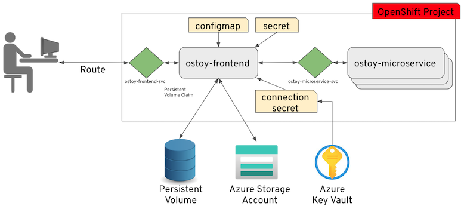
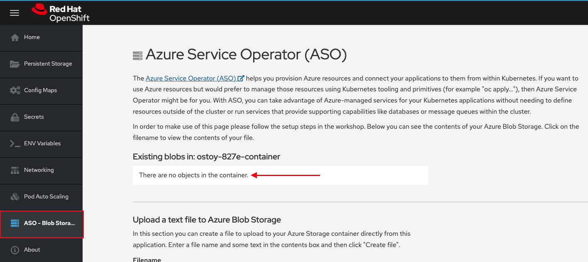
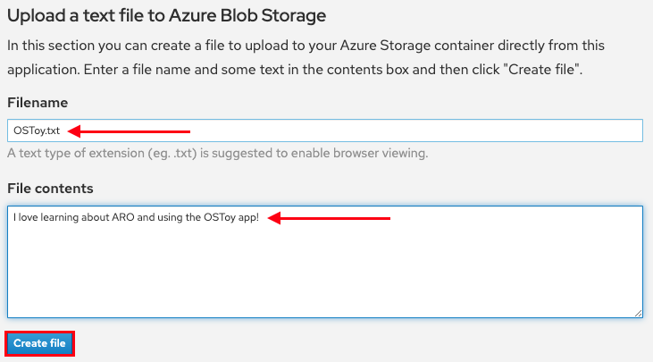
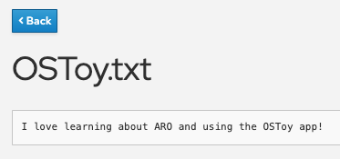

= Integrating with Azure services

So far, our OSToy application has functioned independently without relying on any external services. While this may be nice for a workshop environment, it's not exactly representative of real-world applications. Many applications require external services like databases, object stores, or messaging services.

In this section, we will learn how to integrate our OSToy application with other Azure services, specifically Azure Blob Storage and Key Vault. By the end of this section, our application will be able to securely create and read objects from Blob Storage.

To achieve this, we will use the Azure Service Operator (ASO) to create the necessary services for our application directly from Kubernetes. We will also utilize Key Vault to securely store the connection secret required for accessing the Blob Storage container. We will create a Kubernetes secret to retrieve this secret from Key Vault, enabling our application to access the Blob Storage container using the secret.

To demonstrate this integration, we will use OSToy to create a basic text file and save it in Blob Storage. Finally, we will confirm that the file was successfully added and can be read from Blob Storage.

== Azure Service Operator (ASO)

The Azure Service Operator (ASO) allows you to create and use Azure services directly from Kubernetes. You can deploy your applications, including any required Azure services directly within the Kubernetes framework using a familiar structure to declaratively define and create Azure services like Storage Blob or CosmosDB databases.

== Key Vault

Azure Key Vault is a cloud-based service provided by Microsoft Azure that allows you to securely store and manage cryptographic keys, secrets, and certificates used by your applications and services.

=== Why should you use Key Vault to store secrets?

.Using a secret store like Azure Key Vault allows you to take advantage of a number of benefits, such as:
. Scalability - Using a secret store service is already designed to scale to handle a large number of secrets over placing them directly in the cluster.
. Centralization - You are able to keep all your organizations secrets in one location.
. Security - Features like access control, monitoring, encryption and audit are already baked in.
. Rotation - Decoupling the secret from your cluster makes it much easier to rotate secrets since you only have to update it in Key Vault and the Kubernetes secret in the cluster will reference that external secret store. This also allows for separation of duties as someone else can manage these resources.

== Section overview

To provide a clearer understanding of the process, the procedure we will be following consists of three primary parts.

. *Install the Azure Service Operator* - This allows you to create/delete Azure services (in our case, Blob Storage) through the use of a Kubernetes Custom Resource. Install the controller which will also create the required namespace and the service account and then create the required resources.
. *Setup Key Vault* - Perform required prerequisites (ex: install CSI drivers), create a Key Vault instance, add the connection string.
. *Application access* - Configuring the application to access the stored connection string in Key Vault and thus enable the application to access the Blob Storage location.

Below is an updated application diagram of what this will look like after completing this section.

== Access the cluster

. Login to the cluster using the `oc` CLI if you are not already logged in.

== Setup

=== Define helper variables

. Set helper environment variables to facilitate execution of the commands in this section.
+
[source,sh,role=execute]
----
export AZURE_SUBSCRIPTION_ID=%azure_subscription_id%
export AZURE_TENANT_ID=%azure_tenant%
export SERVICE_PRINCIPAL_CLIENT_ID=%azappid%
export SERVICE_PRINCIPAL_CLIENT_SECRET=%azpass%
export REGION=eastus
export RESOURCE_GROUP=openenv-${GUID}
export PROJECT_NAME=ostoy-${GUID}
----
////
RESORUCE_GROUP is %resourcegroup% in agd, but needs to be part of provision data
REGION, also in agd,but not in provision data
////

=== Install the Azure Service Operator

. We first need to install Cert Manager. Run the following.
+
[source,sh,role=execute]
----
oc apply -f https://github.com/jetstack/cert-manager/releases/download/v1.11.1/cert-manager.yaml
----

. Confirm that the cert-manager pods have started successfully before continuing.
+
[source,sh,role=execute]
----
oc get pod -n cert-manager
----
+
.Sample Output
[source,text,options=nowrap]
----
NAME                                       READY   STATUS    RESTARTS   AGE
cert-manager-677874db78-t6wgn              1/1     Running   0          4m
cert-manager-cainjector-6c5bf7b759-l722b   1/1     Running   0          4m
cert-manager-webhook-5685fdbc4b-rlbhz      1/1     Running   0          4m
----

. We then need to add the latest Helm chart for the ASO.
+
[source,sh,role=execute]
----
# Azure Service Operator
helm repo add aso2 https://raw.githubusercontent.com/Azure/azure-service-operator/main/v2/charts

# Update local repo list
helm repo update
----

. Install the Azure Service Operator.
+
[source,sh,role=execute]
----
helm upgrade --install --devel aso2 aso2/azure-service-operator \
  --create-namespace \
  --namespace=azureserviceoperator-system \
  --set azureSubscriptionID=$AZURE_SUBSCRIPTION_ID \
  --set azureTenantID=$AZURE_TENANT_ID \
  --set azureClientID=$SERVICE_PRINCIPAL_CLIENT_ID \
  --set azureClientSecret=$SERVICE_PRINCIPAL_CLIENT_SECRET
----

. Ensure that the pods are running successfully.  This could take about 2 minutes.
+
[source,sh,role=execute]
----
oc get pod -n azureserviceoperator-system
----
+
.Sample Output
[source,text,options=nowrap]
----
NAME                                                       READY   STATUS    RESTARTS      AGE
azureserviceoperator-controller-manager-6c667599f6-pql98   2/2     Running   1 (5m ago)    6m
----

== Create Storage Accounts and containers using the ASO

Now we need to create a Storage Account for our Blob Storage, to use with OSToy.
We could create this using the CLI or the Azure Portal, but wouldn't it be nice if we could do so using standard Kubernetes objects? We could have defined the all these resources in once place (like in the deployment manifest), but for the purpose of gaining experience we will create each resource separately below.

. Create a NEW project namespace for this lab.
+
[source,sh,role=execute]
----
oc new-project ${PROJECT_NAME}
----

. Create a ResourceGroup object in our project.
+
[source,sh,role=execute]
----
cat << EOF | oc apply -f -
apiVersion: resources.azure.com/v1api20200601
kind: ResourceGroup
metadata:
  name: ${RESOURCE_GROUP}
  namespace: ${PROJECT_NAME}
spec:
  location: ${REGION}
EOF
----

. Create a Storage Account.
+
[source,sh,role=execute]
----
cat << EOF | oc apply -f -
apiVersion: storage.azure.com/v1api20210401
kind: StorageAccount
metadata:
  name: ostoystorage${GUID}
  namespace: ${PROJECT_NAME}
spec:
  location: ${REGION}
  kind: BlobStorage
  sku:
    name: Standard_LRS
  owner:
    name: ${RESOURCE_GROUP}
  accessTier: Hot
EOF
----

. Confirm that it was created. It may take a minute or two to appear.
+
[source,sh,role=execute]
----
az storage account list --query '[].name' --output tsv | grep ostoystorage${GUID}
----

. Create a Blob Service.
+
[source,sh,role=execute]
----
cat << EOF | oc apply -f -
apiVersion: storage.azure.com/v1api20210401
kind: StorageAccountsBlobService
metadata:
  name: ostoystorage${GUID}service
  namespace: ${PROJECT_NAME}
spec:
  owner:
    name: ostoystorage${GUID}
EOF
----

. Finally create a storage container.
+
[source,sh,role=execute]
----
cat << EOF | oc apply -f -
apiVersion: storage.azure.com/v1api20210401
kind: StorageAccountsBlobServicesContainer
metadata:
  name: ${PROJECT_NAME}-container
  namespace: ${PROJECT_NAME}
spec:
  owner:
    name: ostoystorage${GUID}service
EOF
----

. Confirm that the container was created. It make take a minute or two to appear.
+
[source,sh,role=execute]
----
az storage container list --auth-mode login --account-name ostoystorage${GUID} --query '[].name' -o tsv
----

. Obtain the connection string of the Storage Account for use in the next section. The connection string contains all the information required to connect to the storage account. This should be guarded and securely stored. The `--name` parameter is the name of the Storage Account we created using the ASO.
+
[source,sh,role=execute]
----
export CONNECTION_STRING=$(az storage account show-connection-string --name ostoystorage${GUID} --resource-group ${RESOURCE_GROUP} -o tsv)
----

The storage account is now set up for use with our application.

== Install Kubernetes Secret Store CSI

In this part we will create a Key Vault location to store the connection string to our Storage account. Our application will use this to connect to the Blob Storage container we created, enabling it to display the contents, create new files, as well as display the contents of the files. We will mount this as a secret in a secure volume mount within our application. Our application will then read that to access the Blob storage.

. Set an environment variable for the name of the Key Vault instance which we will create.
+
[source,sh,role=execute]
----
export KEYVAULT_NAME=secret-store-${GUID}
----

. To simplify the process for this lab, a script is provided that will do the prerequisite work in order to use Key Vault stored secrets. If you are curious, please feel free to read the script, otherwise just run it. This should take about 1-2 minutes to complete.
+
[source,sh,role=execute]
----
curl https://raw.githubusercontent.com/microsoft/aroworkshop/master/resources/setup-csi.sh | bash
----
+
Or, if you'd rather not live on the edge, feel free to download it first.

. Create an Azure Key Vault.
+
[source,sh,role=execute]
----
az keyvault create -n $KEYVAULT_NAME --resource-group ${RESOURCE_GROUP} --location $REGION
----

. Store the connection string as a secret in Key Vault.
+
[source,sh,role=execute]
----
az keyvault secret set --vault-name $KEYVAULT_NAME --name connectionsecret --value $CONNECTION_STRING
----

. Set an Access Policy for the Service Principal. This allows the Service Principal to get secrets from the Key Vault instance.
+
[source,sh,role=execute]
----
az keyvault set-policy -n $KEYVAULT_NAME --secret-permissions get --spn $SERVICE_PRINCIPAL_CLIENT_ID
----

. Create a secret for Kubernetes to use to access the Key Vault. When this command is executed, the Service Principal's credentials are stored in the `secrets-store-creds` Secret object, where it can be used by the Secret Store CSI driver to authenticate with Azure Key Vault and retrieve secrets when needed.
+
[source,sh,role=execute]
----
oc create secret generic secrets-store-creds \
-n $PROJECT_NAME \
--from-literal clientid=$SERVICE_PRINCIPAL_CLIENT_ID \
--from-literal clientsecret=$SERVICE_PRINCIPAL_CLIENT_SECRET
----

. Create a label for the secret. By default, the secret store provider has filtered watch enabled on secrets. You can allow it to find the secret in the default configuration by adding this label to the secret.
+
[source,sh,role=execute]
----
oc -n $PROJECT_NAME label secret secrets-store-creds secrets-store.csi.k8s.io/used=true
----

. Create the Secret Provider Class to give access to this secret. To learn more about the fields in this class see https://learn.microsoft.com/en-us/azure/aks/hybrid/secrets-store-csi-driver#create-and-apply-your-own-secretproviderclass-object[SecretProviderClass] object.
+
[source,sh,role=execute]
----
cat <<EOF | oc apply -f -
apiVersion: secrets-store.csi.x-k8s.io/v1
kind: SecretProviderClass
metadata:
  name: azure-kvname
  namespace: $PROJECT_NAME
spec:
  provider: azure
  parameters:
    usePodIdentity: "false"
    useVMManagedIdentity: "false"
    userAssignedIdentityID: ""
    keyvaultName: "${KEYVAULT_NAME}"
    objects: |
      array:
        - |
          objectName: connectionsecret
          objectType: secret
          objectVersion: ""
    tenantId: "${AZURE_TENANT_ID}"
EOF
----

== Create a custom Security Context Constraint (SCC)

SCCs are outside the scope of this lab. Though, in short, OpenShift SCCs are a mechanism for controlling the actions and resources that a pod or container can access in an OpenShift cluster. SCCs can be used to enforce security policies at the pod or container level, which helps to improve the overall security of an OpenShift cluster. For more details please see https://docs.openshift.com/container-platform/latest/authentication/managing-security-context-constraints.html[Managing security context constraints].

. Create a new SCC that will allow our OSToy app to use the Secrets Store Provider CSI driver. The SCC that is used by default, `restricted`, does not allow it. So in this custom SCC we are explicitly allowing access to CSI. If you are curious feel free to view the file first, the last line in specific.
+
[source,sh,role=execute]
----
oc apply -f https://raw.githubusercontent.com/microsoft/aroworkshop/master/yaml/ostoyscc.yaml
----

. Create a Service Account for the application.
+
[source,sh,role=execute]
----
oc create sa ostoy-sa -n $PROJECT_NAME
----

. Grant permissions to the Service Account using the custom SCC we just created.
+
[source,sh,role=execute]
----
oc adm policy add-scc-to-user ostoyscc system:serviceaccount:${PROJECT_NAME}:ostoy-sa -n ${PROJECT_NAME}
----

== Deploy the OSToy application

. Deploy the application. First deploy the microservice.
+
[source,sh,role=execute]
----
oc apply -n $PROJECT_NAME -f https://raw.githubusercontent.com/microsoft/aroworkshop/master/yaml/ostoy-microservice-deployment.yaml
----

. Run the following to deploy the frontend. This will automatically remove the comment symbols for the new lines that we need in order to use the secret.
+
[source,sh,role=execute]
----
curl https://raw.githubusercontent.com/microsoft/aroworkshop/master/yaml/ostoy-frontend-deployment.yaml | sed 's/#//g' | oc apply -n $PROJECT_NAME -f -
----

== See the Blob Storage contents through OSToy

After about a minute, we can use our app to see the contents of our blob storage container.

. Get the route for the newly deployed application.
+
[source,sh,role=execute]
----
oc get route ostoy-route -o jsonpath='{.spec.host}{"\n"}' -n ${PROJECT_NAME}
----

. Open a new browser tab and enter the route from above. Ensure that it is using `http://`` and **not** `https://``.

. A new menu item will appear. Click on "ASO - Blob Storage" in the left menu in OSToy.

. You will see a page that lists the contents of our Blob storage container, which at this point should be empty.

Move on to the next step to add some files.

== Create files in your Azure Blob Storage Container

For this step we will use OStoy to create a file and upload it to the Blob Storage Container. While Blob Storage can accept any kind of file, for this workshop we'll use text files so that the contents can easily be rendered in the browser.

. Click on "ASO - Blob Storage" in the left menu in OSToy.

. Scroll down to the section underneath the "Existing files" section, titled "Upload a text file to Blob Storage".

. Enter a file name for your file.

. Enter some content for your file.

. Click "Create file".
+

. Scroll up to the top section for existing files and you should see your file that you just created there.

. Click on the file name to view the file.
+

. Now to confirm that this is not just some smoke and mirrors, let's confirm directly via the CLI. Run the following to list the contents of our Blob Storage.
+
[source,sh,role=execute]
----
az storage blob list --account-name ostoystorage${GUID} --connection-string $CONNECTION_STRING -c ${PROJECT_NAME}-container --query "[].name" -o tsv
----

We should see our file(s) returned.
